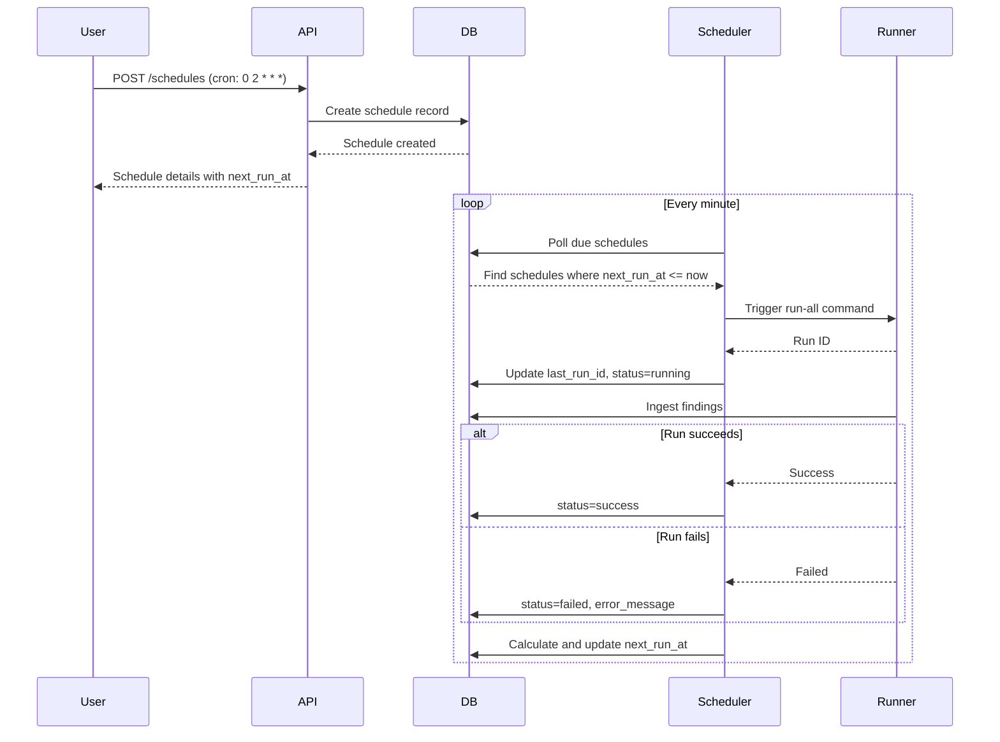

# AWS Account Connection Wizard - Architecture Design

## Overview

The AWS Account Connection Wizard enables users to securely connect their AWS accounts to the FinOps system using cross-account IAM roles. This provides read-only access to AWS resources for cost optimization analysis.

## Architecture

```mermaid
flowchart TD
    subgraph "User Flow"
        UI[Portal UI]
        CF[CloudFormation Template]
        ARN[Role ARN Input]
        Test[Connection Test]
    end

    subgraph "API Layer"
        POST[POST /api/aws-connections]
        GET[GET /api/aws-connections]
        PUT[PUT /api/aws-connections/{id}/test]
        DELETE[DELETE /api/aws-connections/{id}]
    end

    subgraph "Database"
        AWS_CONN[aws_connections table]
    end

    subgraph "Verification"
        STS[STS Assume Role]
        EC2[EC2 DescribeRegions]
        CE[CE GetCostAndUsage]
    end

    UI --> POST
    UI --> CF
    CF --> ARN
    ARN --> POST
    POST --> AWS_CONN
    UI --> Test
    Test --> STS
    STS --> EC2
    STS --> CE
    CE --> UI
```

## Database Schema

### Table: `aws_connections`

```sql
CREATE TABLE aws_connections (
    -- Primary identifiers
    id UUID PRIMARY KEY DEFAULT gen_random_uuid(),
    tenant_id VARCHAR NOT NULL,
    workspace VARCHAR NOT NULL,
    
    -- AWS Account details
    aws_account_id VARCHAR(12) NOT NULL,
    account_name VARCHAR(255),  -- Friendly name
    role_arn VARCHAR(2048) NOT NULL,
    external_id VARCHAR(128),  -- For enhanced security
    
    -- Regions to scan (NULL = all regions)
    regions JSONB DEFAULT '["all"]',
    
    -- Connection status
    status VARCHAR(20) DEFAULT 'pending',  -- pending, connected, failed, disabled
    last_verified_at TIMESTAMPTZ,
    last_verified_by VARCHAR,
    last_error TEXT,
    
    -- Metadata
    created_by VARCHAR,
    created_at TIMESTAMPTZ DEFAULT now(),
    updated_at TIMESTAMPTZ DEFAULT now(),
    
    -- Unique constraint
    UNIQUE(tenant_id, workspace, aws_account_id)
);

-- Indexes
CREATE INDEX idx_aws_connections_tenant ON aws_connections(tenant_id, workspace);
CREATE INDEX idx_aws_connections_status ON aws_connections(status);
```

## Required IAM Permissions

The cross-account role needs read-only permissions to the following services:

### Core Services (Required)
```json
{
    "Version": "2012-10-17",
    "Statement": [
        {
            "Effect": "Allow",
            "Action": [
                "ec2:Describe*",
                "s3:ListAllMyBuckets",
                "s3:GetBucketLocation",
                "s3:GetBucketPolicy",
                "s3:GetBucketTagging",
                "rds:DescribeDBInstances",
                "rds:DescribeDBSnapshots",
                "rds:DescribeDBEngineVersions",
                "lambda:ListFunctions",
                "lambda:GetFunction",
                "cloudwatch:Describe*",
                "cloudwatch:GetMetricStatistics",
                "logs:DescribeLogGroups",
                "logs:DescribeLogStreams"
            ],
            "Resource": "*"
        }
    ]
}
```

### Optional Services (For Enhanced Checks)
```json
{
    "Effect": "Allow",
    "Action": [
        "ecs:ListClusters",
        "ecs:DescribeClusters",
        "eks:ListClusters",
        "eks:DescribeCluster",
        "fsx:DescribeFileSystems",
        "efs:DescribeFileSystems",
        "elasticloadbalancing:DescribeLoadBalancers",
        "backup:ListBackupVaults",
        "backup:DescribeBackupVault",
        "backup:ListRecoveryPoints",
        "savingsplans:DescribeSavingsPlans",
        "ce:GetCostAndUsage",
        "ce:GetSavingsPlansUtilization",
        "cloudfront:ListDistributions"
    ],
    "Resource": "*"
}
```

## API Endpoints

### 1. Generate CloudFormation Template

```
GET /api/v1/aws-connections/template
```

**Response:**
```json
{
    "cloudformation_template": "AWSTemplateFormatVersion: '2010-09-09'...",
    "external_id": "unique-uuid-for-tenant",
    "instructions": "Step-by-step guide for deployment"
}
```

### 2. Create AWS Connection

```
POST /api/v1/aws-connections
```

**Request:**
```json
{
    "tenant_id": "acme",
    "workspace": "prod",
    "aws_account_id": "123456789012",
    "role_arn": "arn:aws:iam::123456789012:role/FinOpsReadOnlyRole",
    "account_name": "Production AWS Account",
    "regions": ["us-east-1", "eu-west-1"]
}
```

**Response (201):**
```json
{
    "id": "uuid",
    "aws_account_id": "123456789012",
    "account_name": "Production AWS Account",
    "status": "pending",
    "created_at": "2026-02-22T18:00:00Z"
}
```

### 3. Test Connection

```
PUT /api/v1/aws-connections/{id}/test
```

**Response (200):**
```json
{
    "id": "uuid",
    "status": "connected",
    "verified_at": "2026-02-22T18:05:00Z",
    "verified_regions": ["us-east-1", "eu-west-1"],
    "services_verified": ["ec2", "rds", "s3", "ce"]
}
```

### 4. List Connections

```
GET /api/v1/aws-connections?tenant_id=acme&workspace=prod
```

**Response (200):**
```json
{
    "connections": [
        {
            "id": "uuid",
            "aws_account_id": "123456789012",
            "account_name": "Production AWS Account",
            "status": "connected",
            "last_verified_at": "2026-02-22T18:05:00Z",
            "regions": ["us-east-1", "eu-west-1"]
        }
    ]
}
```

### 5. Delete Connection

```
DELETE /api/v1/aws-connections/{id}
```

## Security Considerations

### External ID Pattern
- Generate unique external ID per tenant/workspace
- Include external ID in CloudFormation template
- Validate external ID when assuming role

### Role Assumption Flow
```python
import boto3

def assume_role(aws_account_id: str, role_arn: str, external_id: str) -> boto3.Session:
    """Assume cross-account role with external ID."""
    sts = boto3.client('sts')
    response = sts.assume_role(
        RoleArn=role_arn,
        RoleSessionName='FinOpsScanner',
        ExternalId=external_id
    )
    return boto3.Session(
        aws_access_key_id=response['Credentials']['AccessKeyId'],
        aws_secret_access_key=response['Credentials']['SecretAccessKey'],
        aws_session_token=response['Credentials']['SessionToken']
    )
```

### Connection Verification Tests
1. **STS GetCallerIdentity** - Verify role is assumable
2. **EC2 DescribeRegions** - Verify regional access
3. **S3 ListBuckets** - Verify S3 access
4. **CE GetCostAndUsage** - Verify Cost Explorer access (global)

## Runner Integration

The runner needs to be updated to iterate over configured AWS connections:

```python
# Pseudocode for runner integration
for connection in get_aws_connections(tenant_id, workspace):
    session = assume_role(
        connection.aws_account_id,
        connection.role_arn,
        connection.external_id
    )
    factory = ServicesFactory(session=session, sdk_config=SDK_CONFIG)
    
    for region in connection.regions or ALL_REGIONS:
        services = factory.for_region(region)
        run_checks(services, context)
```

## Implementation Phases

### Phase 1: Core Infrastructure
- [ ] Database schema migration
- [ ] API endpoints (CRUD)
- [ ] CloudFormation template generator

### Phase 2: Connection Verification
- [ ] STS assume role implementation
- [ ] Connection test endpoint
- [ ] Status tracking

### Phase 3: Runner Integration
- [ ] Multi-account support in runner
- [ ] External ID validation
- [ ] Region filtering

### Phase 4: UI Integration
- [ ] Wizard flow in portal
- [ ] Connection status dashboard
- [ ] Error reporting

## Open Questions

1. Should we support IAM User access keys as an alternative to cross-account roles?
2. Do we need to support AWS Organizations integration for auto-discovery?
3. Should we cache credentials or re-assume for each scan?
4. How to handle connections that lose access mid-scan?

---

# Built-in Scheduler API - Architecture Design

## Overview

The built-in scheduler enables users to create, manage, and execute scheduled scans from the UI or API. This replaces external cron jobs with a native solution.

## Database Schema

### Table: `schedules`

```sql
CREATE TABLE schedules (
    -- Primary identifiers
    id UUID PRIMARY KEY DEFAULT gen_random_uuid(),
    tenant_id VARCHAR NOT NULL,
    workspace VARCHAR NOT NULL,
    
    -- Schedule configuration
    name VARCHAR(255) NOT NULL,
    description TEXT,
    
    -- Cron expression (standard cron format)
    cron_expression VARCHAR(100) NOT NULL,
    
    -- Timezone for schedule execution
    timezone VARCHAR(50) DEFAULT 'UTC',
    
    -- Run configuration
    enabled BOOLEAN DEFAULT true,
    skip_ingest BOOLEAN DEFAULT false,
    skip_export BOOLEAN DEFAULT false,
    skip_recover BOOLEAN DEFAULT false,
    
    -- Pricing metadata
    pricing_version VARCHAR(50),
    pricing_source VARCHAR(255),
    
    -- Execution tracking
    last_run_at TIMESTAMPTZ,
    next_run_at TIMESTAMPTZ,
    last_run_id UUID,
    last_run_status VARCHAR(20),
    
    -- Metadata
    created_by VARCHAR,
    created_at TIMESTAMPTZ DEFAULT now(),
    updated_at TIMESTAMPTZ DEFAULT now(),
    
    -- Unique constraint
    UNIQUE(tenant_id, workspace, name)
);

-- Indexes
CREATE INDEX idx_schedules_tenant ON schedules(tenant_id, workspace);
CREATE INDEX idx_schedules_next_run ON schedules(next_run_at) WHERE enabled = true;
CREATE INDEX idx_schedules_status ON schedules(enabled);
```

### Table: `schedule_runs` (execution log)

```sql
CREATE TABLE schedule_runs (
    id UUID PRIMARY KEY DEFAULT gen_random_uuid(),
    schedule_id UUID NOT NULL REFERENCES schedules(id),
    
    -- Run timing
    scheduled_at TIMESTAMPTZ NOT NULL,
    started_at TIMESTAMPTZ,
    completed_at TIMESTAMPTZ,
    
    -- Run result
    status VARCHAR(20) DEFAULT 'pending',  -- pending, running, success, failed, cancelled
    run_id UUID,  -- Reference to the scan run
    error_message TEXT,
    
    created_at TIMESTAMPTZ DEFAULT now()
);

CREATE INDEX idx_schedule_runs_schedule ON schedule_runs(schedule_id);
CREATE INDEX idx_schedule_runs_status ON schedule_runs(status);
```

## Cron Expression Format

Standard cron format with optional seconds:
- `0 2 * * *` - Daily at 2:00 AM UTC
- `0 2 * * 1-5` - Weekdays at 2:00 AM UTC
- `0 2 * * 0,6` - Weekends at 2:00 AM UTC
- `0 */6 * * *` - Every 6 hours
- `0 0 1 * *` - First day of month at midnight

## API Endpoints

### 1. Create Schedule

```
POST /api/v1/schedules
```

**Request:**
```json
{
    "tenant_id": "acme",
    "workspace": "prod",
    "name": "Nightly Production Scan",
    "description": "Daily scan of production AWS accounts",
    "cron_expression": "0 2 * * *",
    "timezone": "Europe/Paris",
    "enabled": true
}
```

**Response (201):**
```json
{
    "id": "uuid",
    "name": "Nightly Production Scan",
    "cron_expression": "0 2 * * *",
    "timezone": "Europe/Paris",
    "enabled": true,
    "next_run_at": "2026-02-23T02:00:00+01:00",
    "created_at": "2026-02-22T18:00:00Z"
}
```

### 2. List Schedules

```
GET /api/v1/schedules?tenant_id=acme&workspace=prod
```

### 3. Get Schedule Details

```
GET /api/v1/schedules/{id}
```

### 4. Update Schedule

```
PUT /api/v1/schedules/{id}
```

### 5. Delete Schedule

```
DELETE /api/v1/schedules/{id}
```

### 6. Trigger Manual Run

```
POST /api/v1/schedules/{id}/run
```

### 7. Get Schedule History

```
GET /api/v1/schedules/{id}/runs?limit=30
```

## Scheduler Worker

### Background Worker Process

The scheduler requires a background worker that:

1. **Polls** for due schedules (every minute)
2. **Locks** schedule to prevent duplicate execution
3. **Triggers** the runner via subprocess or queue
4. **Updates** status based on run completion

```python
# Pseudocode for scheduler worker
import croniter
from datetime import datetime, timezone

def poll_schedules(db_pool):
    now = datetime.now(timezone.utc)
    
    with db_pool.connection() as conn:
        # Find schedules due for execution
        schedules = conn.execute("""
            SELECT * FROM schedules
            WHERE enabled = true
            AND next_run_at <= %s
            ORDER BY next_run_at
            LIMIT 10
        """, (now,))
        
        for schedule in schedules:
            # Skip if already running
            if schedule.last_run_status == 'running':
                continue
            
            # Trigger execution
            trigger_run(schedule)
            
            # Calculate next run time
            cron = croniter(schedule.cron_expression, now)
            next_run = cron.get_next(datetime)
            
            conn.execute("""
                UPDATE schedules
                SET last_run_at = %s,
                    next_run_at = %s
                WHERE id = %s
            """, (now, next_run, schedule.id))
```

## Execution Flow



## UI Integration

### Schedule List View
- Name, cron expression, next run, last run status
- Toggle enable/disable
- Edit/Delete actions
- Manual trigger button

### Schedule Editor
- Name and description
- Cron expression builder (dropdown presets + custom)
- Timezone selector
- Options checkboxes (skip ingest, skip export, etc.)

### Schedule History
- List of past runs with status
- Link to run details
- Error messages for failed runs

## Implementation Phases

### Phase 1: Core Scheduler
- [ ] Database schema migration
- [ ] API endpoints (CRUD)
- [ ] Scheduler worker (polling loop)
- [ ] Cron expression parsing (croniter)

### Phase 2: UI Integration
- [ ] Schedule list component
- [ ] Schedule editor/form
- [ ] Schedule history view
- [ ] Enable/disable toggle

### Phase 3: Advanced Features
- [ ] Schedule overlap protection
- [ ] Retry on failure
- [ ] Email notifications on failure
- [ ] Slack integration
